# Using K-Means algorithm for segmentation customers

Include K-Means and Mini Batch K-Means (advanced of K-Means)

## Getting Started

### Dependencies

* Using jupyter notebook in Google Colab

### Executing program

* Load data from xlsx files
```
df_ = pd.read_excel('/content/drive/MyDrive/online_retail_II.xlsx', sheet_name='Year 2009-2010', engine='openpyxl')
df = df_.copy()
df.head()
```
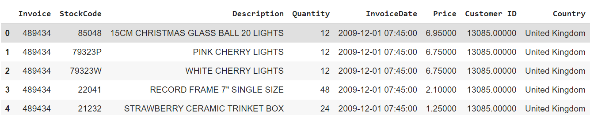

* Clean data
```
df.dropna(inplace=True)
df = df.dropna(subset=['Customer ID'])

df = df.drop_duplicates()

df.duplicated().sum()
```
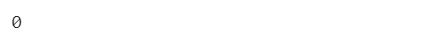

* Simple map of countries
```
data_map = dict(type='choropleth', locations = countries.index, locationmode = 'country names', z = countries, text = countries.index, colorbar = {'title':'Row nb.'}, colorscale=[[0, 'rgb(224,255,255)'], [0.01, 'rgb(166,206,227)'], [0.02, 'rgb(31,120,180)'], [0.03, 'rgb(178,223,138)'], [0.05, 'rgb(51,160,44)'], [0.10, 'rgb(251,154,153)'], [0.20, 'rgb(255,255,0)'], [1, 'rgb(227,26,28)']], reversescale = False)
layout = dict(autosize=False, width=1000, height=600,title='Number of rows per country', geo=dict(showframe=True, projection={'type':'mercator'}))

map_of_countries = go.Figure(data=[data_map],layout=layout)
iplot(map_of_countries, validate=False)
```
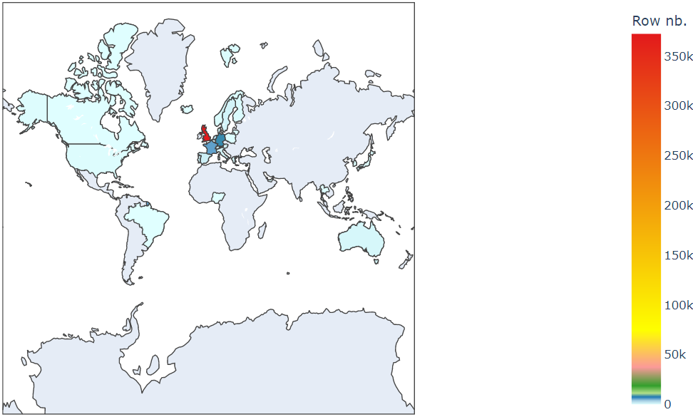

* Build a heatmap for retension rates of customers
```
plt.figure(figsize=(15, 7))
plt.title('Retention rates of customers')
sns.heatmap(data=retention, annot=True, fmt= '.0%', vmin= 0.0, vmax= 0.5, cmap='PuBu_r')
plt.show()
```
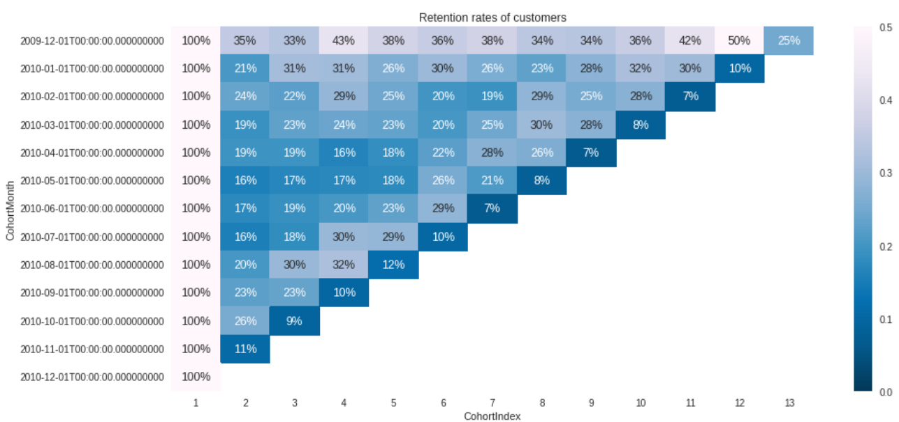

* Build the heat map for average quantity
```
plt.figure(figsize=(15, 7))
plt.title('Average quantity for each cohort')
sns.heatmap(data=average_quantity, annot= True, vmin= 0.0, vmax= 20, cmap='BuGn_r')
plt.show()
```
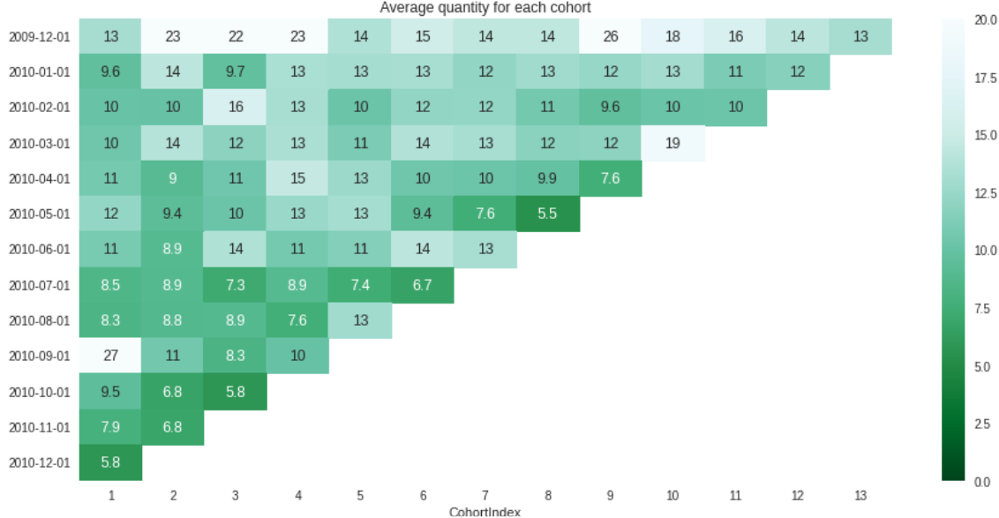

* Summary metrics per RFM score
```
rfm_seg.groupby('RFM_Score').agg({'Recency': 'mean', 'Frequency': 'mean', 'Monetary': ['mean', 'count']}).round(1)
```
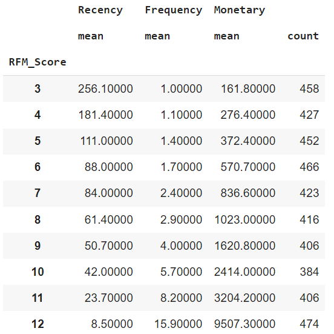

* Used RFM score to group customers into Diamond, Platinum, Gold, Silver, Bronze and Iron segments
```
def segments(df):
  if (df['RFM_Score'] > 11):
    return 'Diamond'
  elif (df['RFM_Score'] > 10) and (df['RFM_Score'] <= 11):
    return 'Platinum'
  elif (df['RFM_Score'] > 8) and (df['RFM_Score'] <= 10):
    return 'Gold'
  elif (df['RFM_Score'] > 6) and (df['RFM_Score'] <= 8):
    return 'Silver'
  elif (df['RFM_Score'] > 4) and (df['RFM_Score'] <= 6):
    return 'Bronze'
  else:
    return 'Iron'

rfm_seg['General_Segment'] = rfm_seg.apply(segments, axis=1)
rfm_seg.groupby('General_Segment').agg({'Recency': 'mean', 'Frequency': 'mean', 'Monetary': ['mean', 'count']}).round(1)
```
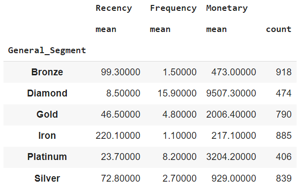

* Standard deviation(std) is the square root of the variance, variance is the average of all data points within a group
```
f, ax = plt.subplots(figsize=(14, 13))
plt.subplot(3, 1, 1)
sns.distplot(rfm['Recency'], label= 'Recency')
plt.subplot(3, 1, 2)
sns.distplot(rfm['Frequency'], label= 'Frequency')
plt.subplot(3, 1, 3)
sns.distplot(rfm['Monetary'], label= 'Monetary')
plt.style.use('fivethirtyeight')
plt.tight_layout()
plt.show()
```
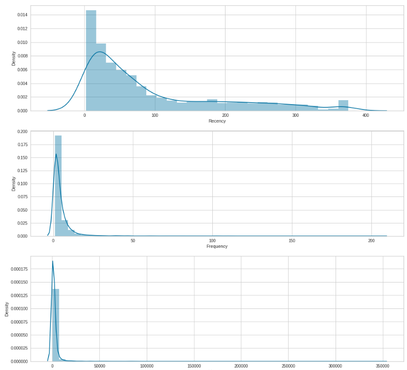

* Define Monetary value threshold value and drop customers who exceed the threshold
```
m_stats = rfm_seg['Monetary'].describe()
m_threshold = m_stats['mean'] + 3 * m_stats['std']
indx = rfm_seg.loc[rfm_seg['Monetary'] > m_threshold].index
rfm_seg.drop(index = indx, inplace= True)

plt.subplot(3, 1, 1)
sns.distplot(rfm_seg['Recency'], label= 'Recency')
plt.subplot(3, 1, 2)
sns.distplot(rfm_seg['Frequency'], label= 'Frequency')
plt.subplot(3, 1, 3)
sns.distplot(rfm_seg['Monetary'], label= 'Monetary')
plt.style.use('fivethirtyeight')
plt.tight_layout()
plt.show()
```
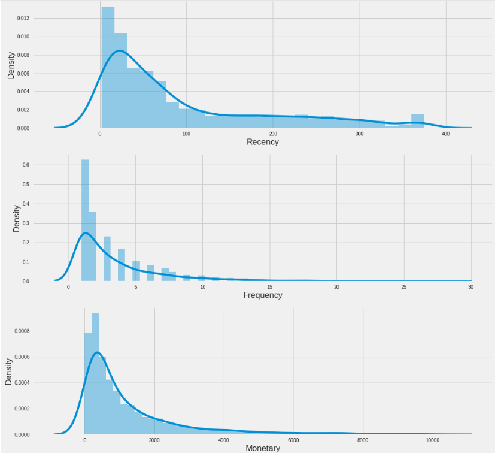

* Unskew the data using log transformation
```
rfm_log = rfm[['Recency', 'Frequency', 'Monetary']].apply(np.log, axis=1).round(3)

f, ax = plt.subplots(figsize=(14, 13))
plt.subplot(3, 1, 1)
sns.distplot(rfm_log['Recency'], label= 'Recency')
plt.subplot(3, 1, 2)
sns.distplot(rfm_log['Frequency'], label= 'Frequency')

plt.subplot(3, 1, 3)
sns.distplot(rfm_log['Monetary'] , label= 'Monetary')
plt.style.use('fivethirtyeight')
plt.tight_layout()
plt.show()
```
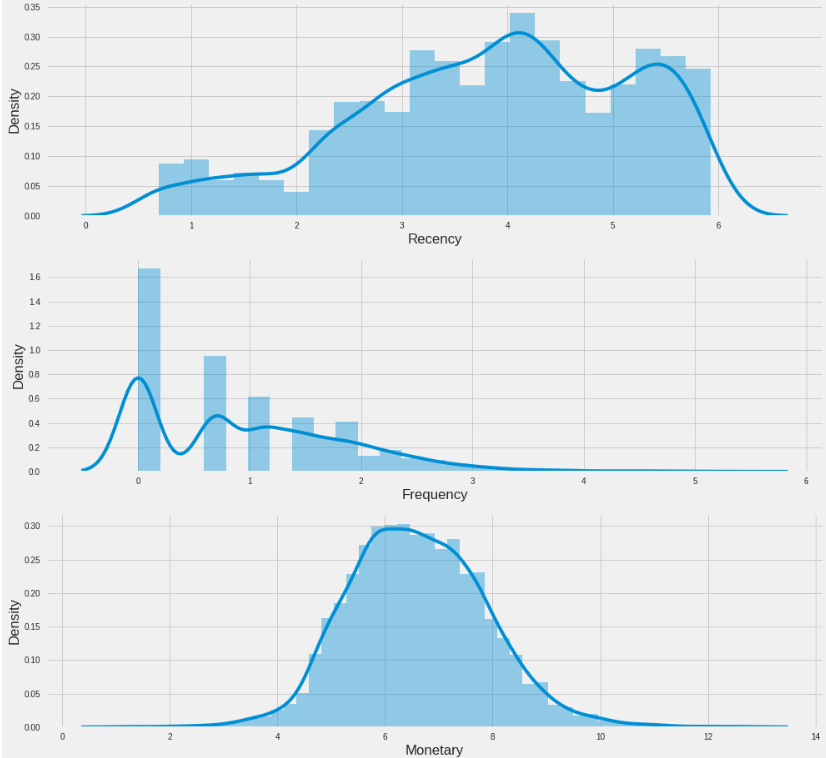

* Elbow method will be used to determine the optimum number of clusters for rfm dataframe
```
kmeans = KMeans()
ssd = []
K = range(1, 30)

for k in K:
  kmeans = KMeans(n_clusters=k).fit(df)
  ssd.append(kmeans.inertia_)

plt.plot(K, ssd, 'bx-')
plt.xlabel('Distance Residual Sums Per Different k Values')
plt.title('Elbow Method for Optimum Number of Clusters')
plt.show()
```
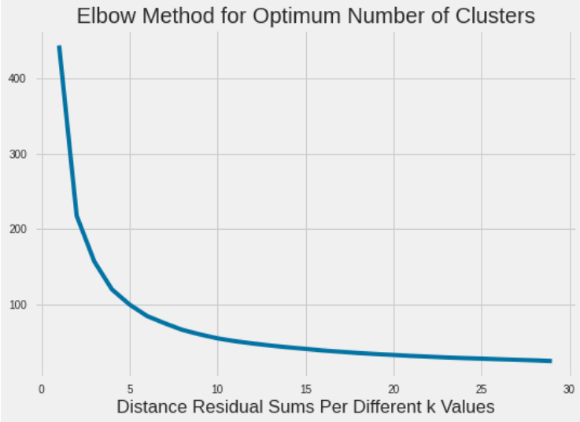

* Make clear the number of clusters
```
kmeans = KMeans()
visu = KElbowVisualizer(kmeans, k=(2, 20))
visu.fit(df)
visu.show()
```
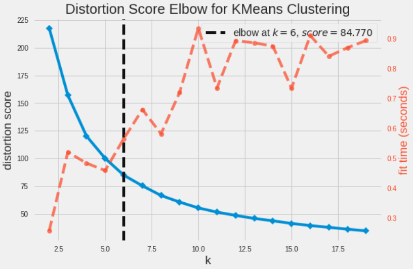

* Make sure the number of clusters by checking with Silhouette Method
```
sil_avg=[]
for s in range(2, 20):
  cluster_sil = KMeans(n_clusters = s).fit_predict(df)
  silhouette_avg = silhouette_score(df, cluster_sil)
  sil_avg.append([s, silhouette_avg])

sil_avg = np.array(sil_avg)
plt.plot(sil_avg[:, 0], sil_avg[:, 1], linestyle='dashed')
plt.xlabel('Number of Clusters')
plt.ylabel('Average Silhouette Score')
plt.legend(['avg_sil'])
plt.show()
```
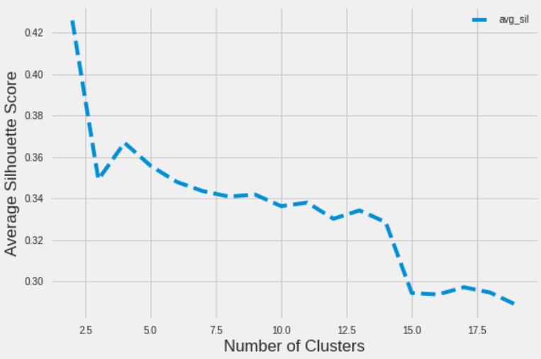

* Average Silhouette Score from 4 to 7 clusters
```
fig, ax = plt.subplots(2, 2, figsize=(20,17))
axli = ax.flatten()
j = 0
for s in range(4, 8):
  cluster_silhouette = KMeans(n_clusters = s)
  visualizer = SilhouetteVisualizer(cluster_silhouette, colors='yellowbrick', ax= axli[j])
  visualizer.fit(df)
  visualizer.finalize()
  j+=1
```
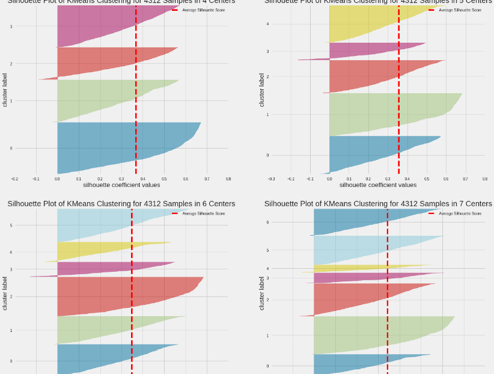

* K-Means algorithm
```
%time kmeans = KMeans(n_clusters=6, init= 'k-means++', n_init=10, random_state=0, max_iter=1000, verbose=0)
start_time = time.time()
kmeans.fit(df)
end_time = time.time() - start_time
clusters = kmeans.labels_
print('\nTotal cell runtime: ', )
```
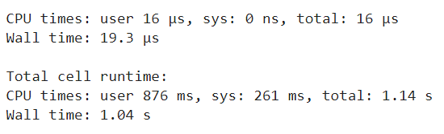

* Mini Batch K-Means algorithm
```
%time mbk = MiniBatchKMeans(n_clusters=6, init= 'k-means++', n_init=10, random_state=0, max_no_improvement=10, batch_size=100, verbose=0)

start_time_mbk = time.time()

mbk.partial_fit(df_mbk)
end_time_mbk = time.time() - start_time_mbk
clusters_mbk = mbk.labels_
print('\nTotal cell runtime: ', )
```
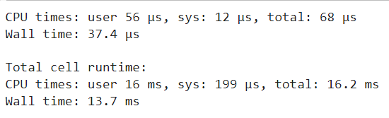

* Snake plot comparisons
```
f, (ax1, ax2, ax3) = plt.subplots(1, 3, figsize=(20, 8))
sns.lineplot(x= 'Metric', y= 'Value', hue= 'General_Segment', data= rfm_melt, ax=ax1)
sns.lineplot(x = 'Metric', y = 'Value', hue = 'Clusters', data = rfm_melt, ax=ax2)
sns.lineplot(x = 'Metric', y = 'Value', hue = 'Clusters', data = rfm_melt_mbk, ax=ax3)
plt.suptitle('Snake Plot of RFM  &&  KMeans  &&  MiniBatchKMeans', fontsize=20)
plt.show()
```
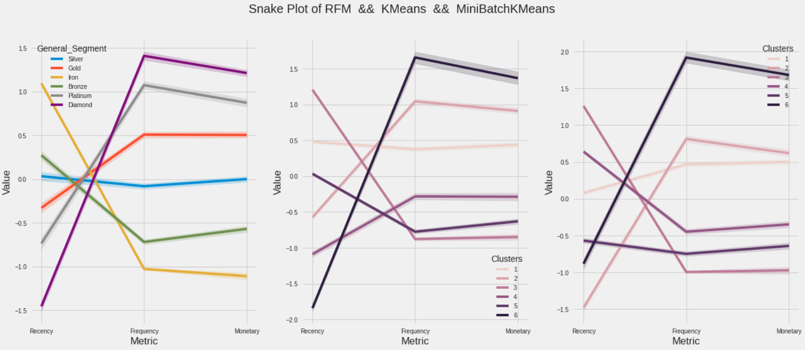

* 3D version of K-Means
```
fig_3d_kmeans = px.scatter_3d(
    kmeans_3,
    x= 'Recency',
    y= 'Frequency', 
    z= 'Monetary', 
    color= (clusters + 1).astype(str),
    opacity= 0.7,
    height= 650,
    width= 700,
    title= 'Clusters Obtained using KMeans<br><sup>Training time: %.3fs & Inertia: %f</sup>' % (end_time, kmeans.inertia_),
    color_discrete_sequence = px.colors.qualitative.Set2
)
fig_3d_kmeans.show()
```
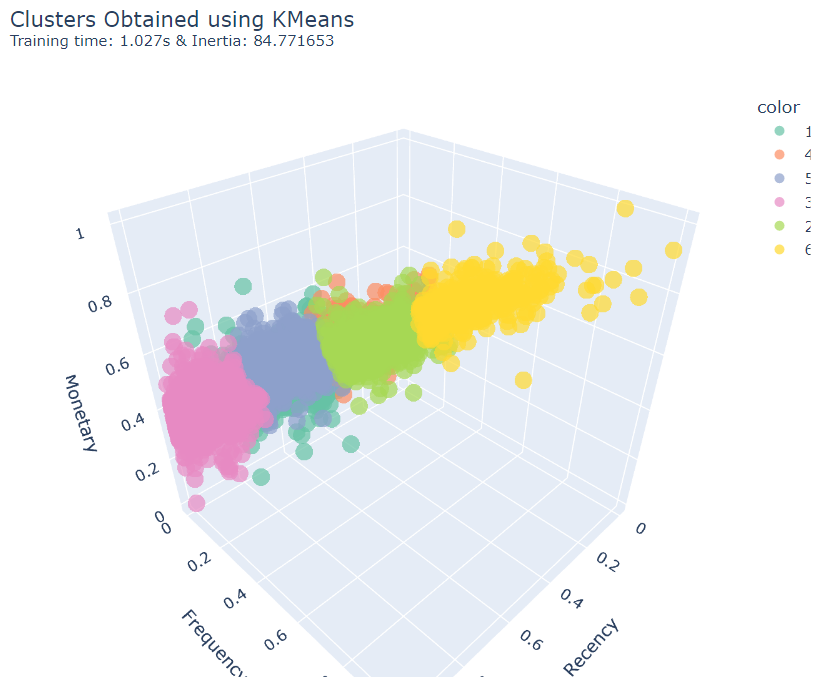

* 3D version of Mini Batch K-Means
```
fig_3d_mbk = px.scatter_3d(
    mbk_3,
    x= 'Recency', 
    y= 'Frequency', 
    z= 'Monetary', 
    color= (clusters_mbk + 1).astype(str),
    opacity= 0.7,
    height= 650,
    width= 700,
    title= 'Clusters Obtained using Mini Batch Kmeans<br><sup>Training time: %.3fs & Inertia: %f</sup>' % (end_time_mbk, mbk.inertia_),
    color_discrete_sequence = px.colors.qualitative.Set2
)
fig_3d_mbk.show()
```
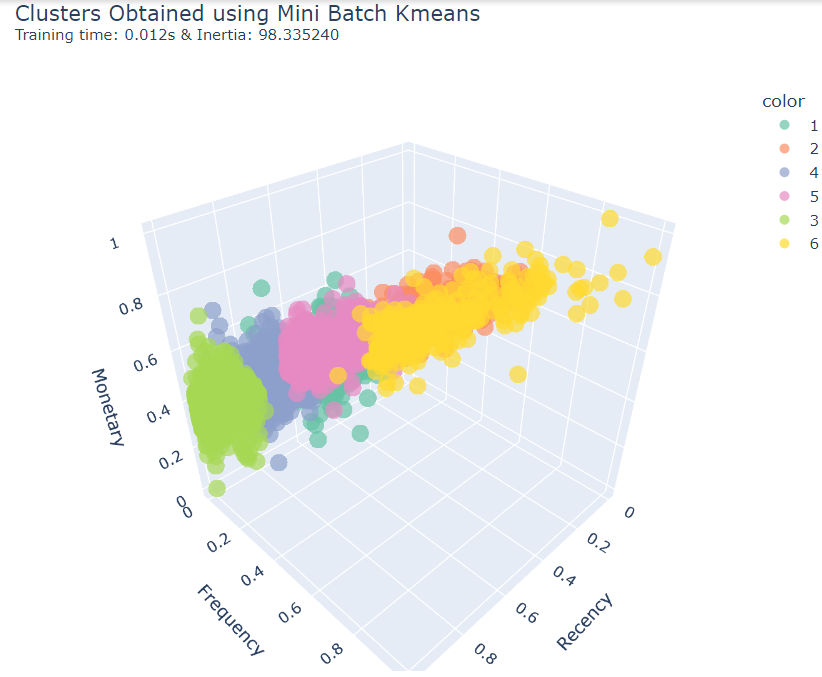

* Show and compare final result image
```
imageKmeans = widgets.Image(value=open('Kmeans.png', 'rb').read())
imageMiniBatchKmeans = widgets.Image(value=open('MiniBatchKmeans.png', 'rb').read())
hbox = HBox([imageKmeans, imageMiniBatchKmeans])
display(hbox)
```
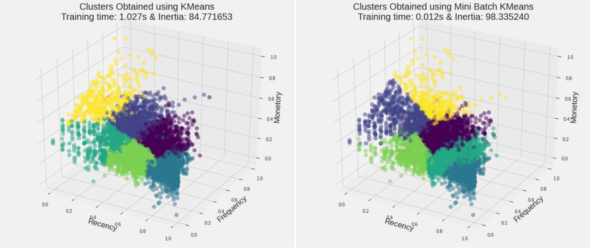

* Distribution of customers
```
df_dis = pd.DataFrame()
df_dis['Distribution Of The KMeans Clusters']= rfm["Cluster"]
df_dis['Distribution Of The Mini Batch KMeans Clusters']= rfm_mbk["Cluster"]

fig, ax =plt.subplots(1,2, figsize=(20,7))
sns.countplot(df_dis['Distribution Of The KMeans Clusters'], ax=ax[0])
sns.countplot(df_dis['Distribution Of The Mini Batch KMeans Clusters'], ax=ax[1])
fig.show()
```
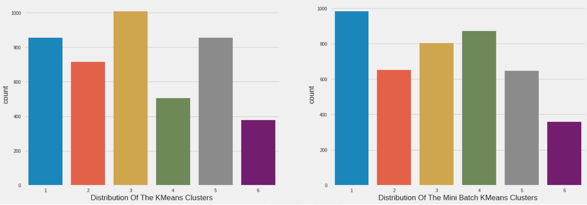

* Recency each clusters
```
df_re = pd.DataFrame()
df_re['KMeans Clusters']= rfm["Cluster"]
df_re['Mini Batch KMeans Clusters']= rfm_mbk["Cluster"]

fig, (ax1, ax2)=plt.subplots(1,2, figsize=(20,7))
sns.swarmplot(x=df_re['KMeans Clusters'], y=rfm['Recency'], color= "#CBEDDD", alpha=0.5, ax=ax1)
sns.boxenplot(x=df_re['KMeans Clusters'], y=rfm['Recency'], ax=ax1)

sns.swarmplot(x=df_re['Mini Batch KMeans Clusters'], y=rfm_mbk['Recency'], color= "#CBEDDD", alpha=0.5, ax=ax2)
sns.boxenplot(x=df_re['Mini Batch KMeans Clusters'], y=rfm_mbk['Recency'], ax=ax2)
fig.show()
```
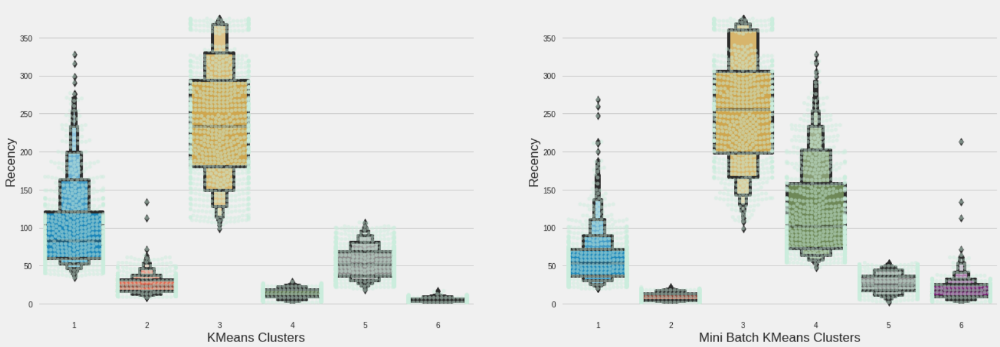

* Frequency each clusters
```
df_fre = pd.DataFrame()
df_fre['KMeans Clusters']= rfm["Cluster"]
df_fre['Mini Batch KMeans Clusters']= rfm_mbk["Cluster"]

fig, (ax1, ax2)=plt.subplots(1,2, figsize=(20,7))
sns.swarmplot(x=df_fre['KMeans Clusters'], y=rfm['Frequency'], color= "#CBEDDD", alpha=0.5, ax=ax1)
sns.boxenplot(x=df_fre['KMeans Clusters'], y=rfm['Frequency'], ax=ax1)

sns.swarmplot(x=df_fre['Mini Batch KMeans Clusters'], y=rfm_mbk['Frequency'], color= "#CBEDDD", alpha=0.5, ax=ax2)
sns.boxenplot(x=df_fre['Mini Batch KMeans Clusters'], y=rfm_mbk['Frequency'], ax=ax2)
fig.show()
```
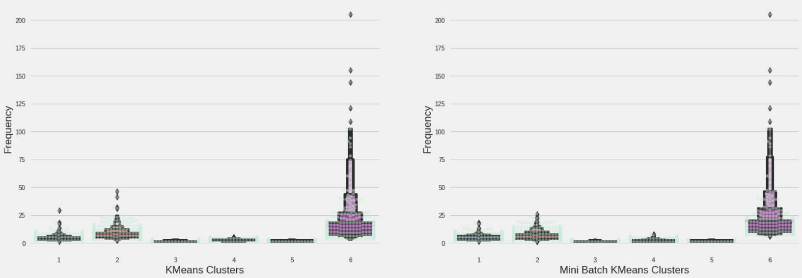

* Monetary each clusters
```
df_mon = pd.DataFrame()
df_mon['KMeans Clusters']= rfm["Cluster"]
df_mon['Mini Batch KMeans Clusters']= rfm_mbk["Cluster"]

fig, (ax1, ax2)=plt.subplots(1,2, figsize=(20,7))
sns.swarmplot(x=df_mon['KMeans Clusters'], y=rfm['Monetary'], color= "#CBEDDD", alpha=0.5, ax=ax1)
sns.boxenplot(x=df_mon['KMeans Clusters'], y=rfm['Monetary'], ax=ax1)

sns.swarmplot(x=df_mon['Mini Batch KMeans Clusters'], y=rfm_mbk['Monetary'], color= "#CBEDDD", alpha=0.5, ax=ax2)
sns.boxenplot(x=df_mon['Mini Batch KMeans Clusters'], y=rfm_mbk['Monetary'], ax=ax2)
fig.show()
```
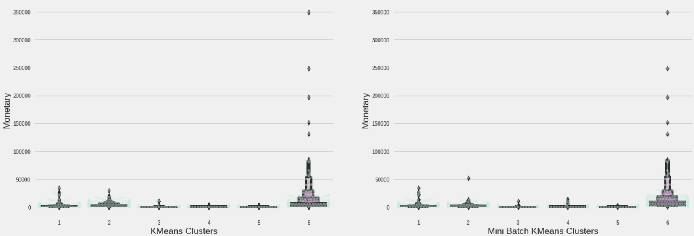

* Show and compare final result image of learning curve
```
imageKmeansLearningCurve = widgets.Image(value=open('KmeansLearningCurve.png', 'rb').read())
imageMiniBatchKmeansLearningCurve = widgets.Image(value=open('MiniBatchKmeansLearningCurve.png', 'rb').read())
hbox_curve = HBox([imageKmeansLearningCurve, imageMiniBatchKmeansLearningCurve])
display(hbox_curve)
```
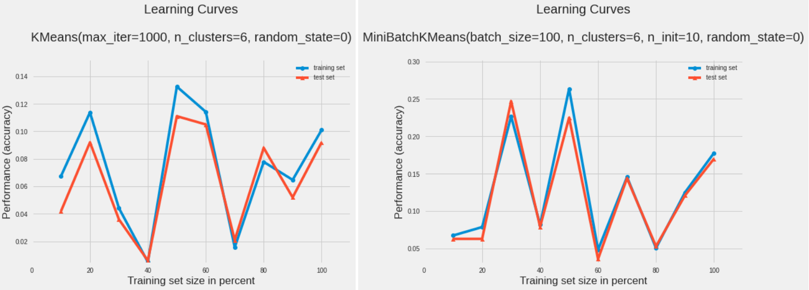

## Authors

[Thang Nguyen](https://github.com/ThangNguyen23)

## Acknowledgments

Maybe you need it
* [jupyter-notebook](https://github.com/jupyter/notebook)
* [googlecolab](https://github.com/googlecolab)